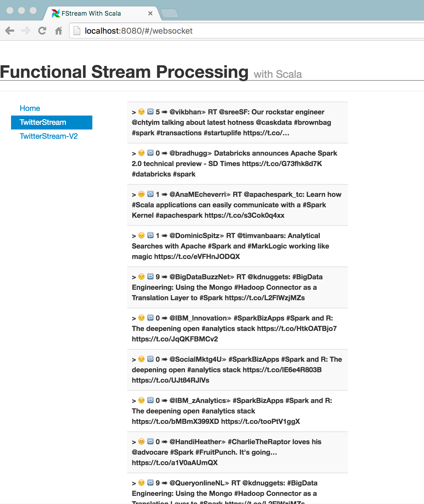

# Functional Stream Processing with Scala 

This repository contains the artefacts of the talk **Functional Stream Processing with Scala** at ScalaItaly 2016.

Primary objective of this talk was to introduce Scalaz-Stream and discuss its key goals, design philosophy and core building block, Process and its semantics. 

Slides of the talk is available [here](./adilakhter-scalaz.pdf). Credits for the images used in slides: [Mario Sixtus]( https://www.flickr.com/photos/sixtus/).


## Code

To get started the examples demonstrated during the talk.  

```
$ git clone https://github.com/adilakhter/scalaitaly-functional-stream-processing.git
$ cd scalaitaly-functional-stream-processing
```

Please update the Twitter's access and consumer keys (which can be generated from https://apps.twitter.com/) at `src/main/resources/logback.xml` and then run the application follows:

```
$ sbt 
> restart
```
It will start running the Demo Application (a Http4s based service) in http://localhost:8080.


In this talk, we presented two examples.

### Example 1

In the first example (see Routes.scala), in every N seconds, we are getting tweets from Twitter. 


```scala 
val query = ...
val source = awakeEvery(5 seconds) |> buildTwitterQuery(query) through queryChannel flatMap {
  Process emitAll _
}
```

Then, several transformations have been performed on source, such as sentiment analysis. 

```scala 
source. map(status ⇒
      Tweet(
        author = Author(status.getUser.getScreenName),
        retweetCount = status.getRetweetCount,
        body = status.getText)
    ) through analysisChannel map (_.toString)
```

Finally, we are connecting the stream to two sinks: A websocket endpoint built using Http4s and also a `io.stdOutLines` sink.

```scala 
val query = new Query("#spark")
val src1: Process[Task, Text] = twitterSource(query)
        .observe(io.stdOutLines) // sink1 
        .map(Text(_))

WS(Exchange(src1, Process.halt)) // sink2 
```

If we run the application and initiate the websocket request, we can see the live stream from twitter: 




### Example 2

In the first example, we have created the source from scratch. But in real world cases, there may be an existing stream of data that we have use as a source. 

Hence, in the second example (see Routes.scala), instead of building a source from scratch, we have used an existing stream with `async.boundedQueue`, via Twitter’s Streaming API and similarly performed the sentiment analysis and connected it to the websocket endpoint. 

```scala 
import TwitterStreamClient._
val tweetsQueue: Queue[Status] = async.boundedQueue[Status](size)

Process.eval_(stream(tweetsQueue))
  .run
  .runAsync { _ ⇒ println("All input data was written") }

tweetsQueue.dequeue.map(status ⇒
  Tweet(
    author = Author(status.getUser.getScreenName),
    retweetCount = status.getRetweetCount,
    body = status.getText)
) through analysisChannel map (_.toString)
```


Disclaimer: Note that these examples are for the demonstration purpose only. Using them in production system would require some careful consideration. 


## References and Further Readings

1.  Scalaz-Stream Masterclass by Runar at [NE Scala 2016]( https://www.youtube.com/watch?v=o3Siln85TJ4).
2.  [Scalaz Task - the missing documentation]( http://timperrett.com/2014/07/20/scalaz-task-the-missing-documentation/)
3.  [scalaz-stream User Notes]( https://aappddeevv.gitbooks.io/test_private_book/content/basics/intro_basics.html)
4.  [Comparing akka-stream and scalaz-stream with code examples]( https://softwaremill.com/comparing-akka-stream-scalaz-stream/)
5.  https://github.com/functional-streams-for-scala/fs2/wiki/Additional-Resources


